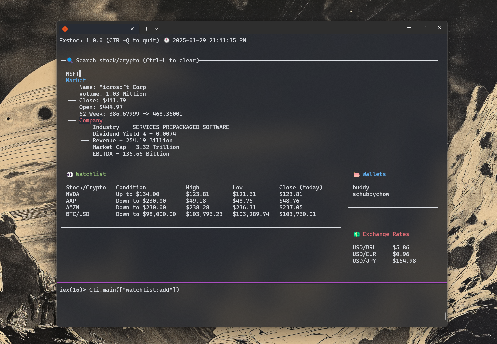

# Exstock


Exstock is a simple elixir CLI+terminal application to watch and get alerts on stock/crypto prices periodically.

**_Built with_**:
- [Elixir](https://hexdocs.pm/elixir/1.18.2/Kernel.html)
- [Ecto](https://hexdocs.pm/ecto/getting-started.html)
- [Oban](https://hexdocs.pm/oban/Oban.html)
- [Ratatouille](https://hexdocs.pm/ratatouille/readme.html#getting-started)



## Structure

```
.
├── Dockerfile
├── LICENSE
├── README.md
├── apps
│   ├── cli - Primary command-line client
│   ├── tracker - Core tracker and watcher
│   └── tui - Terminal UI
├── config
│   ├── config.exs
│   ├── dev.exs
│   ├── prod.exs
│   └── test.exs
├── mix.exs
└── mix.lock
```

## Quick start

- Fill out your credentials on `config/dev.exs` (see `config/config.exs` for reference)

Install dependencies

```sh
mix deps.get
mix ecto.migrate
```

Run TUI

```sh
mix run apps/tui/tui.exs
```

## Tests

```sh
mix test
```

## Linting & Formatting

```sh
mix format
```

## License

This project is under the [MIT license](https://github.com/jeferson-sb/exstock/blob/main/LICENSE)
